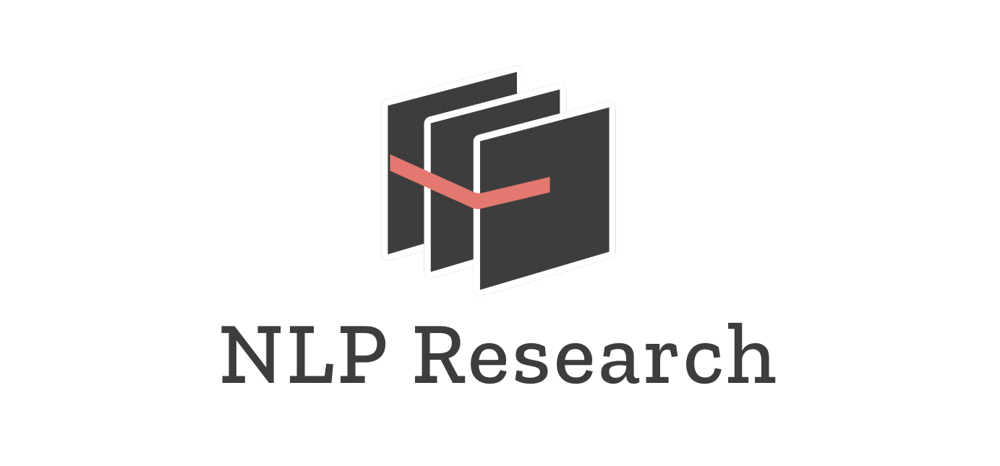

## Who we are:
NLP Research at Cornell Data Science works on developing cutting-edge machine learning methods for natural language processing. Our objective is to provide insights and discoveries to the NLP community through scientific research.

**Advisor:** [Professor Thorsten Joachims](http://www.cs.cornell.edu/people/tj/)  
**Team Leads:** [Kenta Takatsu](https://github.com/Kenta426) (CS '19)

## Current Projects:
* [QuACC: Question Answering for Cornell Courses](https://github.com/CornellDataScience/QuACC)
* [DuQI: Duplicate Question Identification](https://github.com/CornellDataScience/DuQI)
* [SWMR: Sentiment Analysis with Moview Reviews](https://github.com/CornellDataScience/SWMR)

## Previous Projects:
* [Extracting Rating Dimensions from Hidden Topics in Text Reviews](https://github.com/CornellDataScience/NLP_Research-FA17/blob/master/latent_variable/submission/extracting-rating-dimensions.pdf)
* [Topic Modeling as a Trend-Aware Performance Metric](https://github.com/CornellDataScience/NLP_Research-FA17/blob/master/topic_over_time/submission/CDS_final_submission.pdf)
* [Identifying Experts in the Yelp Dataset](https://github.com/CornellDataScience/NLP_Research-FA17/blob/master/local-experts/submission/Final_Paper.pdf)
* [On the Use of K-Competitive Networks for Writing Style Transfer](https://github.com/CornellDataScience/NLP_Research-FA17/blob/master/dl_style_transfer/submission/k-competitive-networks.pdf)

## Members (SP2018):
* [Xuwen Shen](https://github.com/Xuwen001) (STAT '18)
* [Yuji Akimoto](https://github.com/yujiakimoto) (CS '19)
* [Arnav Ghosh](https://github.com/garnav) (CS '19)
* [Brandon Kates](https://github.com/BrandonKates) (BTRY '19)
* [Zhao Shen](https://github.com/yuzhshen) (CS '19)
* [Chetan Velivela](https://github.com/Srivelivela) (CS '19)
* [Xinzhe Yang](https://github.com/xinzheyang) (CS '20)
* [Katie Yang](https://github.com/yangkt) (CS '21)
